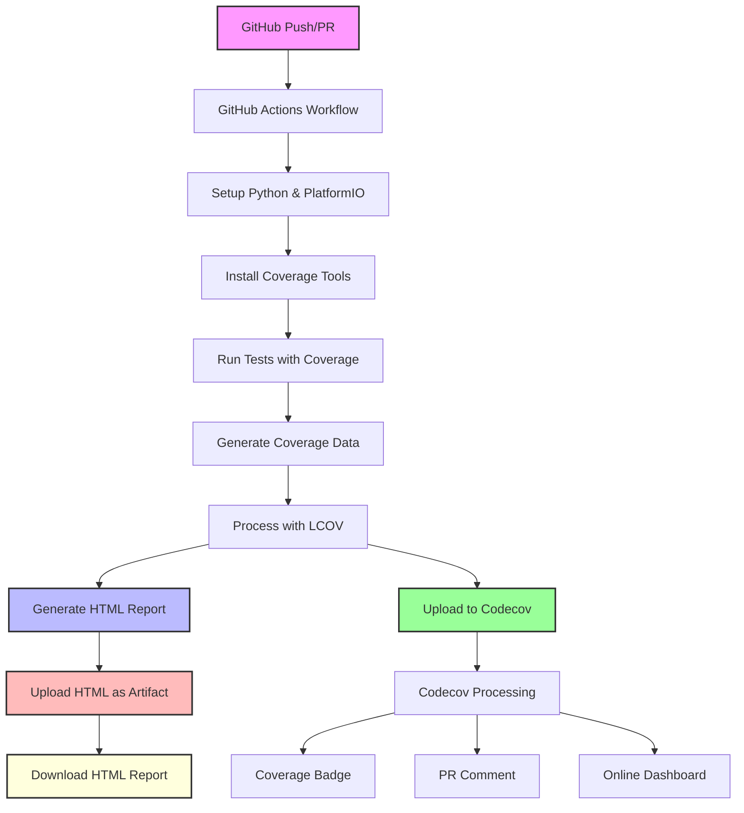

# Code Coverage Implementation Plan

## Overview

This document outlines the implementation of a comprehensive code coverage solution for the Nissan Hardbody RFID project. The solution provides both online and offline coverage reporting capabilities through:

1. **Codecov Integration** - For online visualization, PR comments, and badges
2. **Local HTML Reports** - As downloadable artifacts for offline viewing

## Architecture



## Implementation Steps

### 1. Update platformio.ini

Add coverage support to the native test environment:

```ini
[env:native]
platform = native
test_framework = unity
build_flags =
    -D UNIT_TEST
    -D USINGMP3
    -I include
    -I lib/mocks
    -I lib/test
    --coverage              ; Enable coverage
    -fprofile-arcs         ; Add profiling
    -ftest-coverage        ; Add test coverage
build_unflags = -Os        ; Disable optimization for accurate coverage
test_ignore = 
    test_native
    test_embedded
test_filter = test_native/*
test_build_src = yes
```

### 2. Update GitHub Actions Workflow

Replace the existing `.github/workflows/platformio-tests.yml` with:

```yaml
name: PlatformIO CI

on:
  push:
    branches: [ main ]
  pull_request:
    branches: [ main ]

jobs:
  test:
    runs-on: ubuntu-latest
    
    steps:
    - uses: actions/checkout@v3
    
    - name: Set up Python
      uses: actions/setup-python@v4
      with:
        python-version: '3.x'
    
    - name: Cache PlatformIO
      uses: actions/cache@v3
      with:
        path: |
          ~/.platformio
          .pio
        key: ${{ runner.os }}-pio-${{ hashFiles('**/platformio.ini') }}
        restore-keys: |
          ${{ runner.os }}-pio-
    
    - name: Install PlatformIO
      run: |
        python -m pip install --upgrade pip
        pip install platformio
    
    - name: Install coverage tools
      run: |
        sudo apt-get update
        sudo apt-get install -y lcov
    
    - name: Run tests with coverage
      run: |
        pio test -e native --verbose
        # Generate coverage info
        lcov --capture --directory .pio/build/native/ --output-file coverage.info
        lcov --remove coverage.info '/usr/*' '*/test/*' '*/lib/mocks/*' --output-file coverage.info
        lcov --list coverage.info
    
    - name: Generate HTML coverage report
      run: |
        genhtml coverage.info --output-directory coverage-report
        
    - name: Upload coverage HTML report
      uses: actions/upload-artifact@v4
      with:
        name: coverage-report-html
        path: coverage-report/
        retention-days: 30
        
    - name: Upload coverage to Codecov
      uses: codecov/codecov-action@v3
      with:
        file: ./coverage.info
        flags: unittests
        name: codecov-umbrella
        fail_ci_if_error: false
    
    - name: Upload test results
      uses: actions/upload-artifact@v4
      if: failure()
      with:
        name: test-results
        path: |
          .pio/build/native/test/
          test/
```

### 3. Create Codecov Configuration

Create `codecov.yml` in the project root:

```yaml
codecov:
  require_ci_to_pass: yes
  
coverage:
  precision: 2
  round: down
  range: "70...100"
  
  status:
    project:
      default:
        target: auto
        threshold: 1%
    patch:
      default:
        target: auto
        threshold: 1%
        
parsers:
  gcov:
    branch_detection:
      conditional: yes
      loop: yes
      method: no
      macro: no

comment:
  layout: "reach,diff,flags,files,footer"
  behavior: default
  require_changes: no

ignore:
  - "test/**/*"
  - "lib/mocks/**/*"
  - ".pio/**/*"
```

### 4. Update README.md

Add the Codecov badge to your README.md (near the top, after the title):

```markdown
[](https://codecov.io/gh/YOUR_USERNAME/nissan-hardbody-rfid)
```

Replace `YOUR_USERNAME` with your GitHub username.

## Features

### Codecov Integration

- **Automatic PR Comments**: Shows coverage changes for each pull request
- **Coverage Badges**: Dynamic badge in README showing current coverage
- **Detailed Reports**: File-by-file and line-by-line coverage visualization
- **Historical Tracking**: Coverage trends over time
- **Team Collaboration**: Shared online dashboard

### Local HTML Reports

- **Offline Access**: Download and view coverage reports without internet
- **Detailed Analysis**: Interactive HTML interface with drill-down capabilities
- **GitHub Actions Artifacts**: Retained for 30 days per workflow run
- **No Account Required**: Accessible to anyone with repository access

## Accessing Coverage Reports

### HTML Reports (Offline)
1. Navigate to the Actions tab in GitHub
2. Click on the specific workflow run
3. Scroll to the "Artifacts" section
4. Download "coverage-report-html"
5. Extract the ZIP and open `index.html` in a browser

### Codecov Reports (Online)
1. Click on the Codecov badge in README
2. Or visit `codecov.io/gh/[username]/nissan-hardbody-rfid`
3. Explore file-by-file coverage
4. View coverage trends and graphs

## Coverage Filtering

The following paths are excluded from coverage reports:
- System files (`/usr/*`)
- Test files (`*/test/*`)
- Mock files (`*/lib/mocks/*`)
- Build files (`.pio/*`)

This ensures coverage metrics focus on actual source code.

## Benefits

| Feature | Codecov | HTML Artifacts |
|---------|---------|----------------|
| PR Integration | ✅ | ❌ |
| Offline Viewing | ❌ | ✅ |
| Historical Trends | ✅ | ❌ |
| No Account Needed | ❌ | ✅ |
| Detailed Line Coverage | ✅ | ✅ |
| Team Collaboration | ✅ | ✅ |

## Setup Instructions

1. **For Public Repositories**: No Codecov token needed - it works automatically
2. **For Private Repositories**: 
   - Sign up at [codecov.io](https://codecov.io)
   - Add repository
   - Copy the upload token
   - Add as GitHub secret named `CODECOV_TOKEN`
   - Update workflow to use: `token: ${{ secrets.CODECOV_TOKEN }}`

## Troubleshooting

### Common Issues

1. **No coverage data generated**
   - Ensure tests are actually running
   - Check that source files are being compiled with coverage flags
   - Verify `.gcno` files exist in `.pio/build/native/`

2. **Coverage appears lower than expected**
   - Check if all source files are included in tests
   - Ensure mock files are properly excluded
   - Verify optimization is disabled (`-Os` flag removed)

3. **HTML report generation fails**
   - Ensure `lcov` is properly installed
   - Check that `coverage.info` file is generated
   - Verify sufficient permissions in CI environment

## Future Enhancements

1. **Coverage Thresholds**: Add minimum coverage requirements
2. **Differential Coverage**: Focus on coverage of changed files
3. **Coverage Trends**: Add visualization of coverage over time
4. **Integration Tests**: Extend coverage to hardware-in-loop tests

## References

- [PlatformIO Unit Testing](https://docs.platformio.org/en/latest/plus/unit-testing.html)
- [LCOV Documentation](http://ltp.sourceforge.net/coverage/lcov.php)
- [Codecov Documentation](https://docs.codecov.io/)
- [GitHub Actions Artifacts](https://docs.github.com/en/actions/using-workflows/storing-workflow-data-as-artifacts)